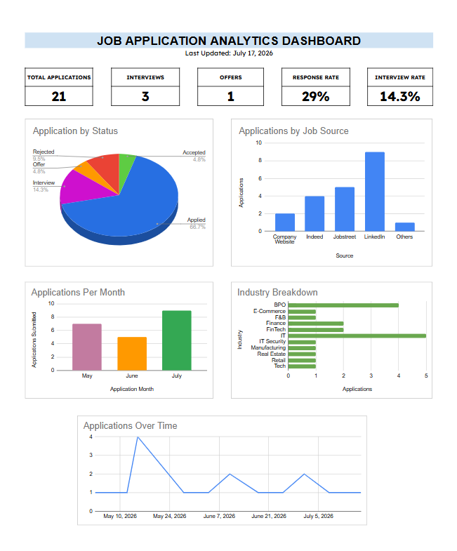
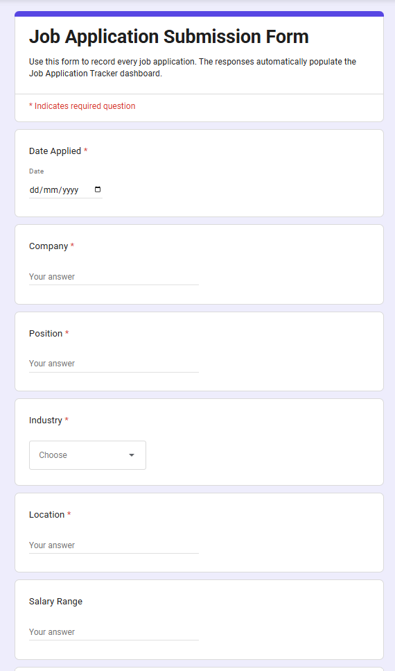
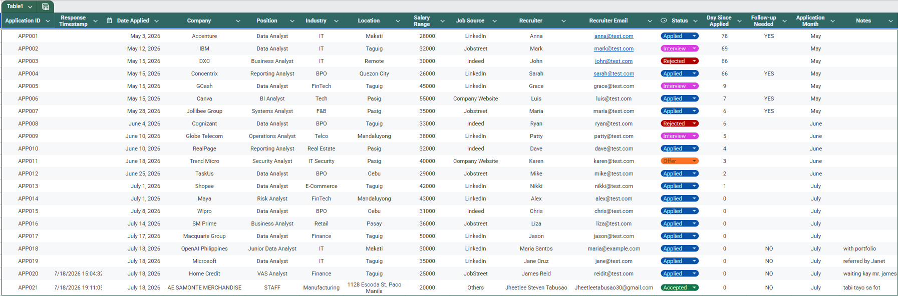
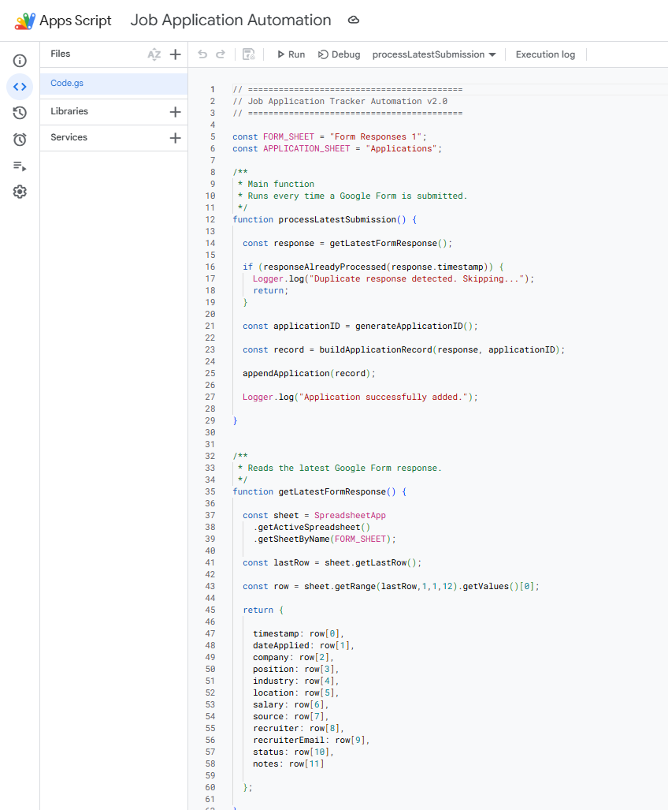

# Automated Job Application Tracker & Analytics Dashboard

A portfolio project that demonstrates **workflow automation, ETL (Extract, Transform, Load), and data visualization** using **Google Sheets, Google Forms, and Google Apps Script**.

The system automates the collection and processing of job application records, enriches each submission with calculated fields, and presents real-time insights through an interactive dashboard.

---

# Dashboard Preview



---

# Project Overview

Managing multiple job applications across different job portals can quickly become difficult. Tracking application statuses, monitoring response rates, and remembering follow-ups manually often leads to inconsistent records and missed opportunities.

This project automates the entire workflow by collecting job application data through Google Forms, processing each submission using Google Apps Script, storing cleaned records in a structured database, and updating an interactive dashboard for real-time reporting.

---

# Objectives

- Automate job application data collection
- Eliminate manual data entry
- Maintain a clean and structured application database
- Generate real-time analytics through dashboards
- Demonstrate ETL workflow automation using Google Workspace

---

# Features

- Automated data collection using Google Forms
- ETL workflow using Google Apps Script
- Automatic Application ID generation (APP001, APP002...)
- Duplicate prevention using Response Timestamp
- Automatic calculation of:
  - Days Since Applied
  - Follow-up Needed
  - Application Month
- Interactive KPI Dashboard
- Pivot Table Reporting
- Automated dashboard updates after every form submission

---

# System Workflow

```text
Google Form
      │
      ▼
Form Responses (Raw Data)
      │
      ▼
Google Apps Script
      │
      ├── Validate Data
      ├── Prevent Duplicates
      ├── Generate Application ID
      ├── Calculate Derived Fields
      │
      ▼
Applications Database
      │
      ▼
Dashboard & Analytics
```

---

# 📈 Dashboard Metrics

The dashboard automatically tracks:

- Total Applications
- Interviews
- Offers
- Response Rate
- Applications by Status
- Applications by Job Source
- Applications by Industry
- Monthly Application Trends

---

# Project Screenshots

## Google Form



---

## Applications Database



---

## Automation Script



---

# 🛠️ Technologies Used

| Category | Tools |
|----------|------|
| Spreadsheet | Google Sheets |
| Data Collection | Google Forms |
| Automation | Google Apps Script (JavaScript) |
| Data Analysis | Pivot Tables |
| Visualization | Charts & KPI Dashboard |
| Version Control | GitHub |

---

# 📂 Repository Structure

```
job-application-tracker-automation/
│
├── README.md
├── screenshots/
│   ├── dashboard.png
│   ├── google-form.png
│   ├── applications-sheet.png
│   └── apps-script.png
│
├── sample-data/
│   └── sample_job_applications.csv
│
└── scripts/
    └── Code.gs
```

---

# Key Technical Highlights

### Workflow Automation
Built an automated workflow that captures Google Form submissions and processes them without manual intervention.

### ETL Pipeline
Implemented an ETL process to:
- Extract data from Google Forms
- Transform records by generating calculated fields
- Load clean data into a structured Applications database

### Data Validation
Implemented duplicate prevention using Google Form response timestamps to avoid duplicate records.

### Dashboard Reporting
Created an interactive dashboard that automatically updates KPIs, charts, and pivot tables whenever new applications are submitted.

---

# Skills Demonstrated

- Data Analysis
- Workflow Automation
- ETL (Extract, Transform, Load)
- Data Cleaning
- Dashboard Development
- Google Apps Script
- Google Sheets
- Google Forms
- Pivot Tables
- Data Visualization
- Process Automation
- Git Version Control

---

# How to Use

1. Open the Google Form.
2. Submit a job application.
3. The Apps Script trigger processes the submission automatically.
4. A unique Application ID is generated.
5. Calculated fields are added.
6. The Applications database is updated.
7. Dashboard metrics and charts refresh automatically.

---

# Author

Trisha Yvonne L. Calibuso
GitHub: https://github.com/g4-misscommit
